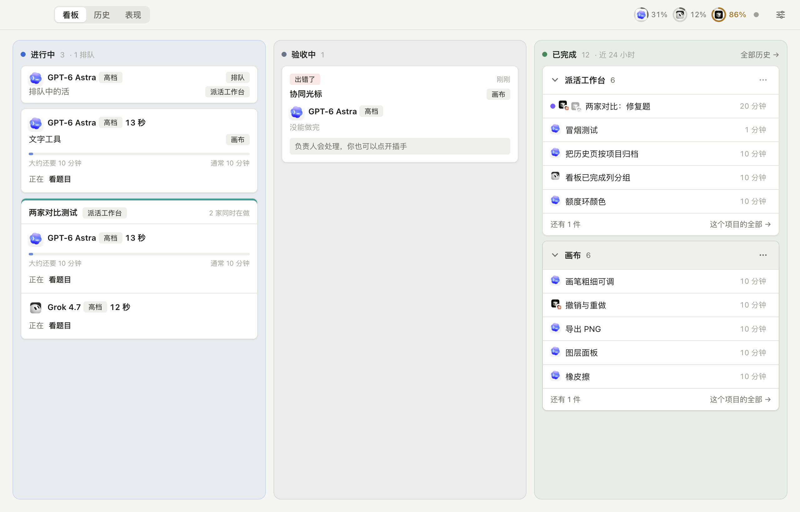
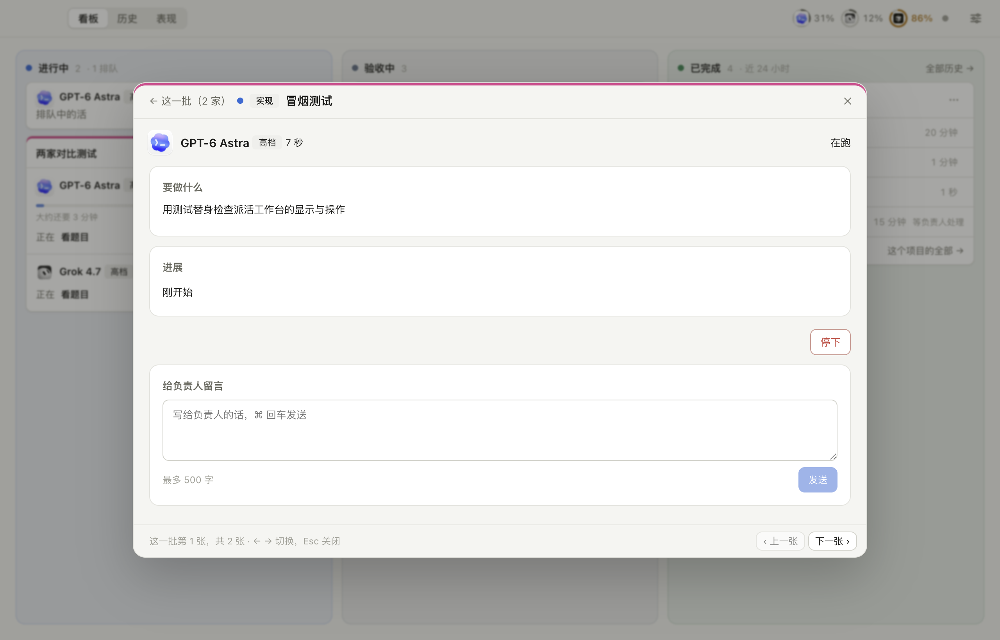
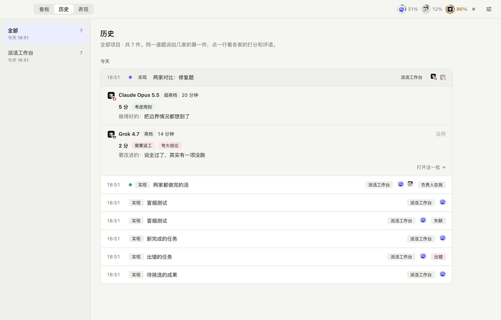
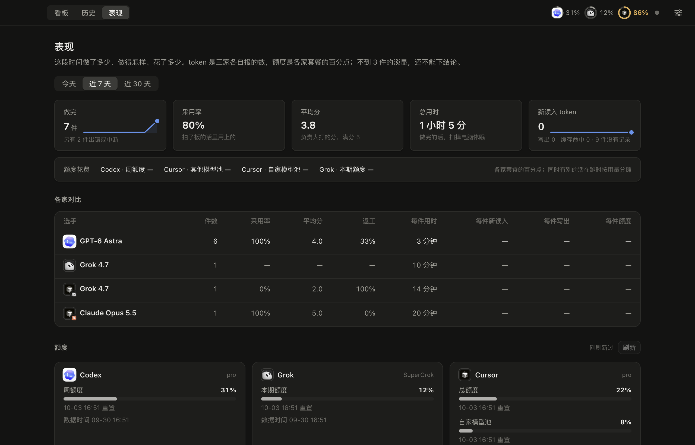
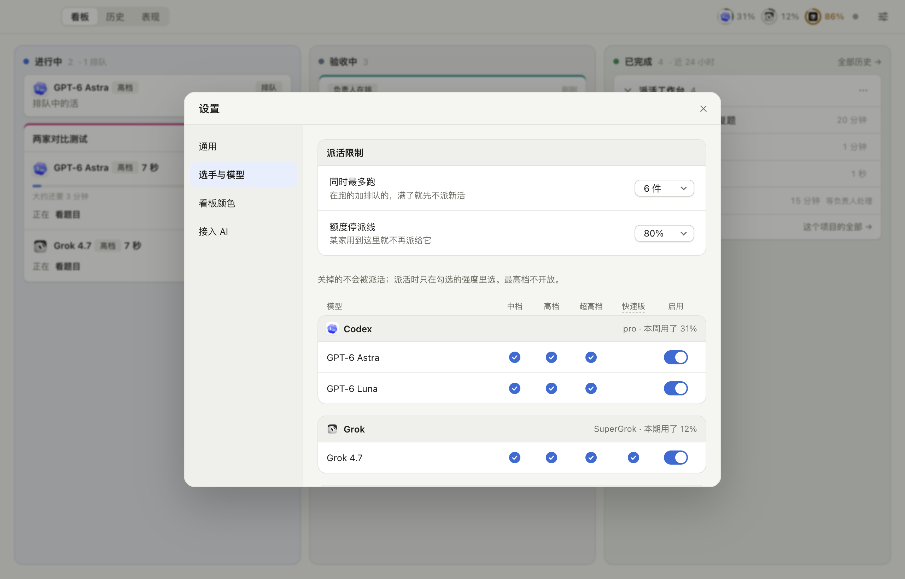
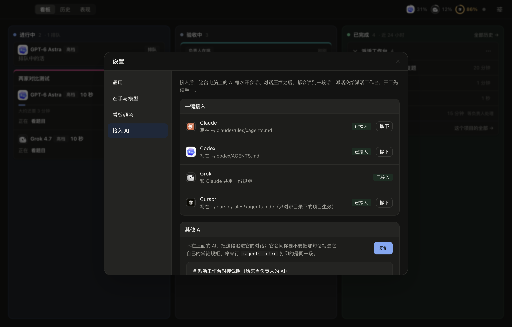
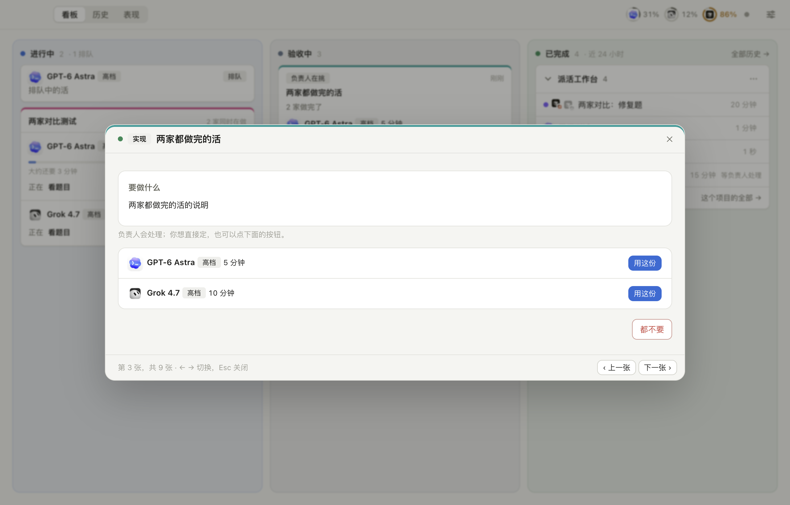

<div align="center">

# 船长派活 · Captain Agents

让一个 AI 当负责人，把编码的活派给你电脑上的 Codex、Grok、Cursor。

简体中文 · [English](README.en.md)

</div>



## 这是什么

如果你同时订了好几家 AI 编码工具，很自然会想：让 Claude 这样的 AI 当负责人，把活拆开分给别家去干，它只管审查和验收。

真这么用上几天，麻烦就来了。谁在做什么、做到哪一步，全靠负责人那段对话记着，对话一压缩就断了。每次派活都得记得给别家的命令行加上限制，漏一次，它就能碰到不该碰的文件。选手说“测试都过了”，自己再跑一遍却不一定过。用久了，谁擅长修 bug、谁爱夸大结论、谁最省额度，也只剩个模糊印象。

船长派活就是把这一套固定下来的小工具：

- 一条命令给每件活开一个独立的 git 副本，把题目派出去；同一道题可以同时派给几家，比比谁做得好。
- 选手只能在自己的副本里干活，网络只通它自家的模型服务器，读不到你的密钥和别家的登录，也改不了各家 AI 的全局配置。这些限制写死在代码里，每天自检一次，没过就不让派。
- 做完以后，负责人在隔离外面重新跑一遍验收，结果记在任务里，不看选手自己怎么说。
- 每件活由负责人打分、写评语，攒多了就有了各家的档案：做完率、合格率、用时、花了多少额度。下次该派给谁，心里就有数了。

你这边只用看桌面应用：看板上是正在做的和做完的，点开能看进度、给负责人留言，觉得哪份好就点“用这份”。具体的派活、验收、合并，都是负责人用命令做的。

> 以前叫派活工作台（piework）。桌面应用和界面暂时还叫派活工作台，命令行工具叫 `xagents`，数据放在 `~/.xagents`；后面的版本会统一改名。

## 看一眼

<table>
<tr>
<td width="50%"><br><sub>点开一件活：要做什么、做到哪、给负责人留言</sub></td>
<td width="50%"><br><sub>历史：同一道题派给几家，各自的打分和评语</sub></td>
</tr>
<tr>
<td><br><sub>表现：做了多少、用上多少、花了多少额度</sub></td>
<td><br><sub>设置：允许哪些选手和强度，同时跑几件，额度用到多少就停</sub></td>
</tr>
<tr>
<td><br><sub>一键接入：让 Claude、Codex、Grok、Cursor 都记得先用派活工作台</sub></td>
<td><br><sub>两家都做完了，你来挑用哪一份，或者都不要</sub></td>
</tr>
</table>

## 装起来

需要一台 Mac（目前只在苹果芯片上测过），Node.js 24 以上，pnpm。另外至少装好并登录一家：[Codex](https://github.com/openai/codex)（默认用 ChatGPT 应用自带的那份，可以用 `XAGENTS_CODEX` 指到别处）、Grok 命令行 `grok`、Cursor 命令行 `cursor-agent`。

```sh
git clone https://github.com/heihuzi-labs/captain-agents.git && cd captain-agents
pnpm install
ln -s "$PWD/bin/xagents" ~/.local/bin/xagents

xagents selfcheck                    # 先过隔离自检
xagents project add demo ~/code/demo --verify "npm test"
xagents run task.md --summary "给登录页加上记住我" --who codex:high
xagents wait <任务号>
xagents verify <任务号>
```

`task.md` 是写给选手的题目，写清要做什么、别碰什么就行，可以参考 [docs/examples/task.md](docs/examples/task.md)。拍板、打分、清理这些后续命令，`xagents --help` 里都有。

想让某个 AI 来当负责人，跟它说一句“先运行 `xagents guide`”就够了，它会读到完整的指挥手册和这台电脑现在的情况。嫌每次都要说，就运行 `xagents connect claude`（`codex`、`cursor` 同理，Grok 和 Claude 共用一份），把这句话写进它的常驻规则。给 Claude Code 用的技能在 [skill/SKILL.md](skill/SKILL.md)。

桌面应用：

```sh
npm run install-app      # 打包并装进“应用程序”
```

开发时也可以 `npm run build && npx electron .` 直接跑。

## 设置

大部分设置在应用里改：允许哪些选手、哪些推理强度、要不要用快速版、同时最多跑几件、额度用到多少就不再派。这些只能比默认更严，不能更松。

还有两处要手写：自己的私密目录想让选手也读不到，就在 `~/.xagents/config.json` 里加 `"denyReadHome": [".my-secrets"]`（相对家目录）；某个项目里的敏感目录，登记项目时用 `--deny-read` 指定（相对仓库）。登记处默认在 `~/.xagents`，用 `XAGENTS_HOME` 可以换地方。

## 安全这件事

Codex 用它自带的权限档来限制，Grok 和 Cursor 外面再套一层 [sandbox-runtime](https://github.com/anthropics/sandbox-runtime)。隔离模板里的每一条都是实测出来的，测的过程记在 [docs/research/](docs/research/)。

也有做不到的：自检只查列出来的那些位置，没法证明所有地方都安全；Grok 和 Cursor 得读得到自己的登录才能启动；各家命令行自动更新后参数可能改名，自检会发现派不出去，但修还得靠人。平台也不会替你合并代码、不会替你判断改得对不对。

发现安全问题，请走 GitHub 的 Security Advisories 私下告诉我们，别开公开 issue。

## 开发

核心逻辑在 `src/core/`，命令行和桌面应用共用；命令行在 `src/cli/`，桌面应用在 `app/`（Electron + React）。

```sh
npm run verify     # 类型检查、核心测试、界面测试、构建、真实窗口冒烟测试
```

测试不联网，不碰你真实的 `~/.xagents`，选手全用替身。README 里的截图也是冒烟测试截的，用的是假数据，带上本机图标的截法：`XAGENTS_E2E_ICONS=~/.xagents/icons npm run test:e2e`。代码约定见 [AGENTS.md](AGENTS.md)，设计见 [docs/design.md](docs/design.md)。

## 许可证

[MIT](LICENSE)。本项目和 OpenAI、xAI、Anysphere（Cursor）、Anthropic 都没有关系，各家的名字和图标归各自所有。

---

<sub>船长系列，来自 [heihuzi-labs](https://github.com/heihuzi-labs)：**船长派活** · [船长 K8s](https://github.com/heihuzi-labs/captain-kube) · [船长运维](https://github.com/heihuzi-labs/captain-ops) · [船长密码箱](https://github.com/heihuzi-labs/captain-password) · [船长待办](https://github.com/heihuzi-labs/captain-todo)</sub>
